# **Lab Report 1 Week 2**

## Welcome

Welcome incoming students 15L students and future me! In this Lab report, I will be writing a tutorial for how to log into  course-specific account on ieng6. This Lab report will be a blog post that describes all the required steps and it will even have screenshots to guide you all.

## Step 1: Installing VSCode
Visual Studio Code is a lightweight but powerful source code editor which runs on your desktop and is available for Windows, macOS and Linux. To install, first go to the [Visual Studio Code Website](https://gdltorre.github.io/cse15l-lab-reports/lab-report-1-week-2.html) and download the file for your corresponding operating system. After that, open the file you just downloaded and follow the instructions for installing.
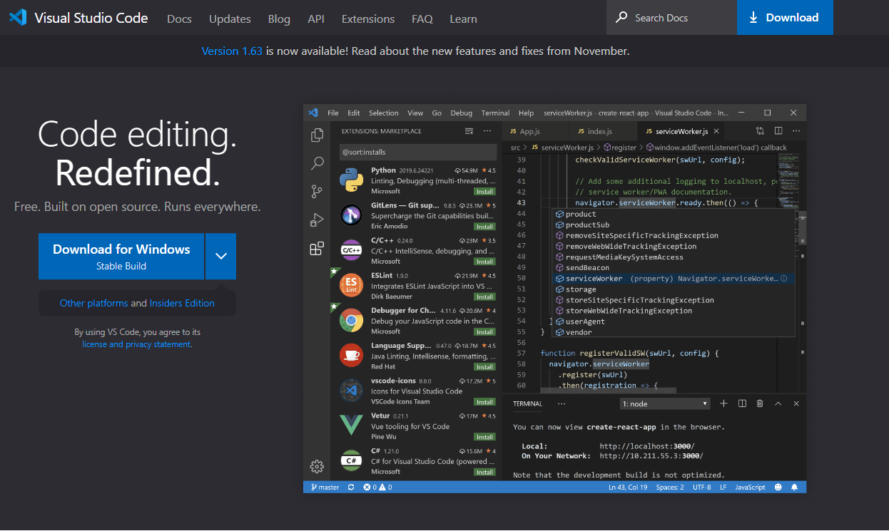

Once installed, you should be able to open a window that looks like this (Colors might be different depending on the settings you choose).
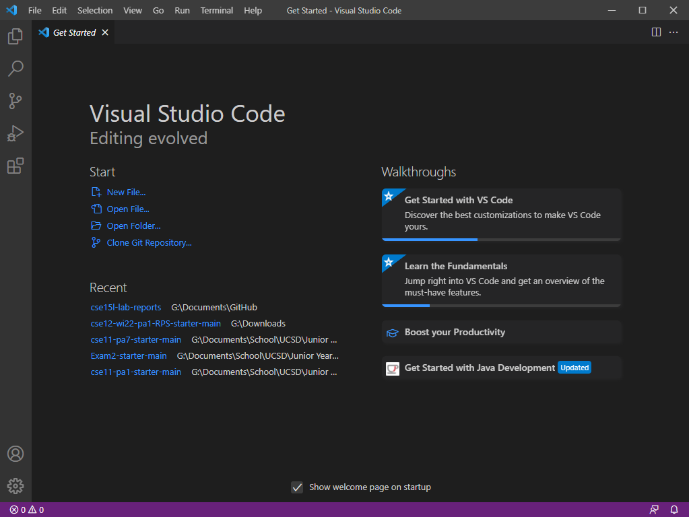

## Step 1.5: Installing OpenSSH (Windows Users)

*The following steps are just for Windows Users*

If you are on Windows, you will first need to install a program called OpenSSH. This program allows you to connect your computer to other computers that have this kind of account.
To begin installation, first run PowerShell as an Administrator and run the following cmdlet to make sure that OpenSSH is available.

```
Get-WindowsCapability -Online | Where-Object Name -like 'OpenSSH*'
```

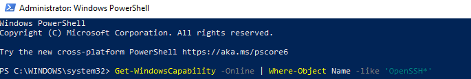

Running the cmdlet should return the following output if neither OpenSSH.server or OpenSSH.client are installed

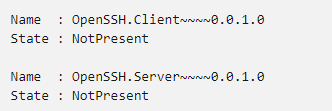

Now, to install the server or client components run the following cmdlet on PowerShell

**Install the OpenSSH Client**
```
Add-WindowsCapability -Online -Name OpenSSH.Client~~~~0.0.1.0
```

**Install the OpenSSH Server**
```
Add-WindowsCapability -Online -Name OpenSSH.Server~~~~0.0.1.0
```
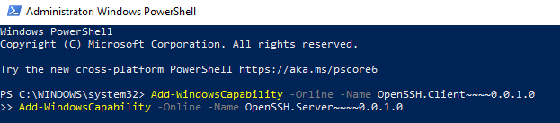

Running those commands should return an output saying that the components are now online and that restarting the computer is not needed.

Now, the last step is to run and configure the OpenSSH server. Once again, open PowerShel as an Administrator and run the following commands to start the sshd service

**To start the sshd service:**
```
Start-Service sshd
```
**This command is optional, but recommended:**

```
Set-Service -Name sshd -StartupType 'Automatic'
```
**The last step is to confirm the firewall rule is configured. It should be created automatically by setup, but it is good to double check**

```
if (!(Get-NetFirewallRule -Name "OpenSSH-Server-In-TCP" -ErrorAction SilentlyContinue | Select-Object Name, Enabled)) {
    Write-Output "Firewall Rule 'OpenSSH-Server-In-TCP' does not exist, creating it..."
    New-NetFirewallRule -Name 'OpenSSH-Server-In-TCP' -DisplayName 'OpenSSH Server (sshd)' -Enabled True -Direction Inbound -Protocol TCP -Action Allow -LocalPort 22
} else {
    Write-Output "Firewall rule 'OpenSSH-Server-In-TCP' has been created and exists."
}
```

## Step 2: Finding your Account
Now that you are done installing OpenSSH, or if you are not a Windows User, the following step is to check what your course-specific account is. For this course, and many other CSE courses, you will be utilizing course-specific accounts. These are similar to accounts you might get on other systems at other institutions (or a future job). To find your account, you will need to [visit this link](https://sdacs.ucsd.edu/~icc/index.php) and input your information for the system to look you up.


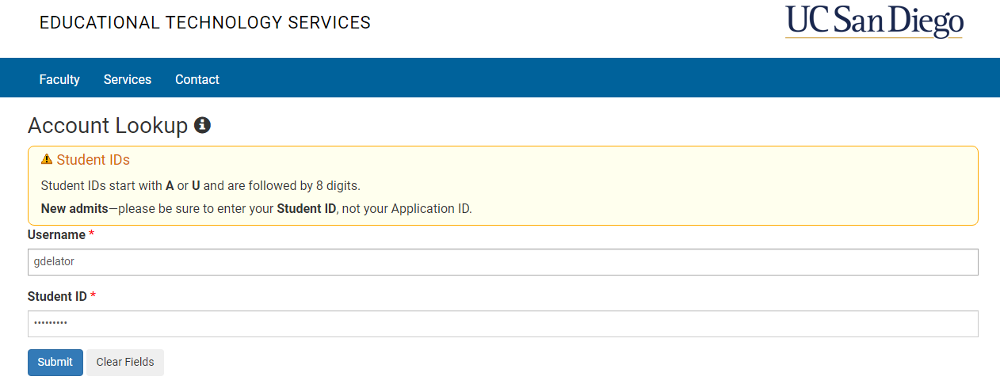

After clicking submit, you will be re-directed to a website that contains information about account. When you are there, you will need to click the button for class that you are interested in knowing your account. In this case, it's going to be cs15lwi22YourUsername, in my case my username is *ajw*


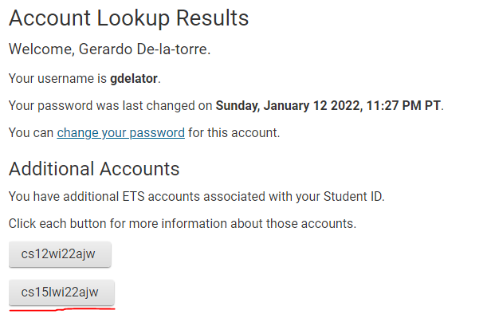

Once you are here, you will need to change your password for your account to be activated. Changing your password will also change it for your TritonLink account, if you don't want that to happen checkmark the box indicating so. You will need to wait a few minutes (5-15) for the password change to take effect. In some cases, you might be required to wait longer than that.


## Step 3: Remotely Connecting

Once you have VSCode installed and you know your what your username is you are now capable of utilizing VSCode to connect to a remote computer over the Internet to do work there. For the first step, open a terminal in VSCode (You can use Ctrl or Command `, or use the Terminal → New Terminal menu option). After that, input the following command, but replace ajw with your username
```
ssh cs15lwi22ajw@ieng6.ucsd.edu
```
Because it is likely that this is your first time connecting to the server, you will probably get a message like this:
```
The authenticity of host 'ieng6.ucsd.edu (128.54.70.227)' can't be established.
RSA key fingerprint is SHA256:ksruYwhnYH+sySHnHAtLUHngrPEyZTDl/1x99wUQcec.
Are you sure you want to continue connecting (yes/no/[fingerprint])? 
```
When you are connecting to a server for the first time, it is likely for that message to appear, in that case I would type "yes" as my choice and then press enter. However, if you get this message to a server that you connect often, it could mean that someone is trying to listen in on or control the connection. You should receive a similar output to this:

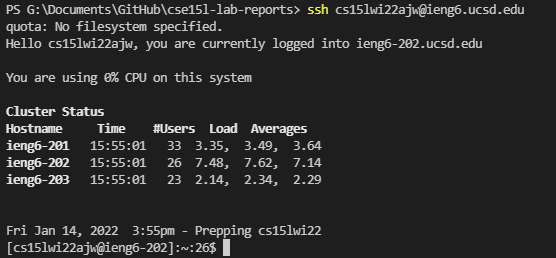

Now, you have been successful connecting your computer to the CSE basement, or wherever you are connecting to! Any commands you run now will be run on the computer you are connected to. Some terminology used is that your computer is the client and the computer you connected to is the server


## Step 4: Trying Some Commands
Now, there are some commands that you can try out while being connected to the computer. Try the following commands:
```
ls
```
```
ls -lat
```
```
ls -a
```
```
pwd
```

These are some of the commands that print out interesting results when connected to the server. Now, to log out you can simply use Ctrl-D or run the command exit
```
exit
```


## Step 5: Moving Files With SCP
One key step when working remotely is to be able to send files back and forth between the user and the client. The command that allows us to do so is the command scp
```
scp
```
scp should always be run from the client computer (Your computer). For this step, create a file named WhereAmI.java and put the following content on it.
```
class WhereAmI {
  public static void main(String[] args) {
    System.out.println(System.getProperty("os.name"));
    System.out.println(System.getProperty("user.name"));
    System.out.println(System.getProperty("user.home"));
    System.out.println(System.getProperty("user.dir"));
  }
}
```
After that, run the command javac WhereAmI.java to compile the file you just created and then run the command java WhereAmI to run the code
```
javac WhereAmI.java
java WhereAmI
```
Now, run this code in your computer so you can compare the difference between running the code on the client and the server. You should receive the following output but with your information

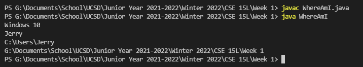

As you can see, running that code will show the information about the computer where the code was ran. What do you expect the output to be when you run it on the server? To send the file to the server, run the following command with your username and corresponding name of the file (WhereAmI.java in this case). You will be prompted with your password because authentication is required.
```
scp WhereAmI.java cs15lwi22YourUsername@ieng6.ucsd.edu:~/
```

Once the file has been uploaded, log in with ssh just like you did previously and use the command ls
```
ls
```

You should see the file listed now on your home directory. After that, run the file on the server computer (ieng6 in this case) using javac and java.
```
javac WhereAmI.java
java WhereAmI
```
Your complete output should be similar to this

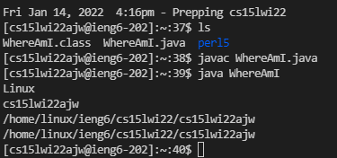

Compare and contrast the difference between running it on the client and the server!


## Step 6: Setting an SSH Key
An ssh key is the solution to the constant necessity of having to input our password everytime we log in, run commands, or copy files with ssh and scp. Is convenient to have an ssh key because it saves you a lot of time on the long run. To set up an ssh key, run the following command on your computer (VSCode)
```
ssh-keygen
```

You will be prompted with the following output
```
Generating public/private rsa key pair.
Enter file in which to save the key (C:\Users\Jerry/.ssh/id_rsa): C:\Users\Jerry/.ssh/id_rsa
Enter passphrase (empty for no passphrase): 
Enter same passphrase again: 
Your identification has been saved in C:\Users\Jerry/.ssh/id_rsa
Your public key has been saved in C:\Users\Jerry/.ssh/id_rsa.pub.
The key fingerprint is:
SHA256:jZaZH6fI8E2I1D35hnvGeBePQ4ELOf2Ge+G0XknoXp0 
The key's randomart image is:
+---[RSA 3072]----+
|                 |
|       . . + .   |
|      . . B o .  |
|     . . B * +.. |
|      o S = *.B. |
|       = = O.*.*+|
|        + * *.BE+|
|           +.+.o |
|             ..  |
+----[SHA256]-----+
```

## Step 6.5: Additional Steps for Windows Users
You will need to run additional commands on PowerShell if you are a Windows user. To run the commands, run PowerShell as an Administrator.
```
Get-Service ssh-agent | Set-Service -StartupType Manual
```
```
Start-Service ssh-agent
```
```
Get-Service ssh-agent
```
```
ssh-add ~\.ssh\id_rsa
```

---

Now, after running those commands you should have created two new files on your system; the private key (in a file id_rsa) and the public key (in a file id_rsa.pub). They will be stored in the .ssh directory on your computer. 

The next step is to copy the public key to the .ssh directory of your user account on the server. To do this, log in with ssh again
```
ssh cs15lwi22YourUsername@ieng6.ucsd.edu
```
```
mkdir .ssh
```
```
logout
```
Now that you are back on the client, run the following command using your username and your corresponding path
```
scp C:\Users\Jerry/.ssh/id_rsa.pub cs15lwi22@ieng6.ucsd.edu:~/.ssh/authorized_keys
```
Now that you are done, you should be able to ssh or scp from this client without entering your password, enjoy!


## Step 7: Optimizing Remote Running
There are additional ways to make remote running more pleasant. Some of the ways that I know are the following:

* Running a command with quotation marks at the end of a ssh command will directly run it on the remote server and then exit.
``` 
ssh cs15lwi22ajw@ieng6.ucsd.edu "ls"
```
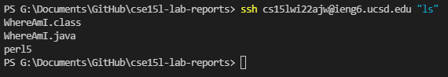
* You can use semicolons to run multiple commands on the same line of code in most terminals
```
javac WhereAmI.java; java WhereAmI
```
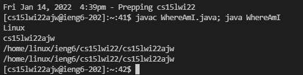
* You can retrieve the last command you ran using the up-arrow key on your keyboard

