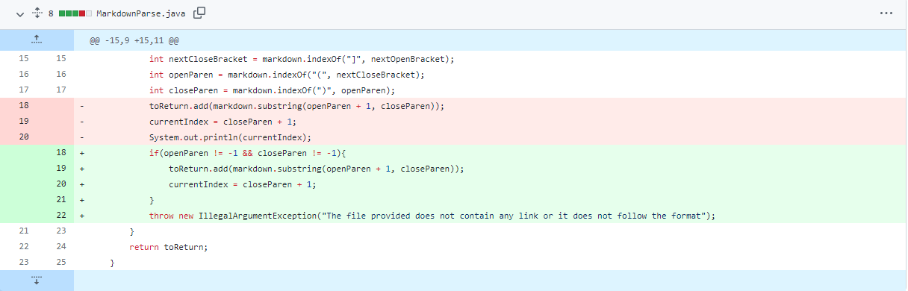
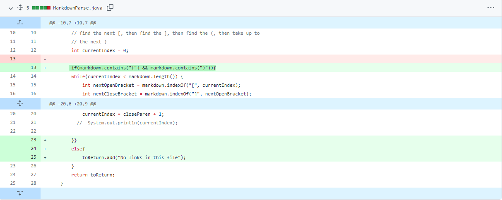
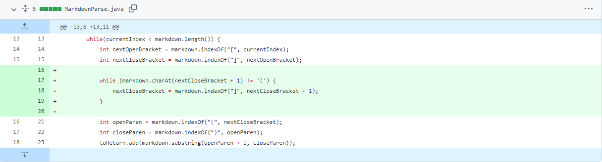

# **Lab Report 2 Week 4**

## First Code Change
The first code change that I am going to be showing for fixing a failure-inducing input is going to be my own. My code change is intended to solve the failure-inducing input of not providing any link on the file.

*Screenshot*


*Link to the test File*

[Failure Inducing Input 1](https://gdltorre.github.io/markdown-parse/test-file2.md)

*Output of Running the File Before Fixing it*
```
Exception in thread "main" java.lang.StringIndexOutOfBoundsException: begin 0, end -1, length 9
        at java.base/java.lang.String.checkBoundsBeginEnd(String.java:4601)
        at java.base/java.lang.String.substring(String.java:2704)
        at MarkdownParse.getLinks(MarkdownParse.java:18)
        at MarkdownParse.main(MarkdownParse.java:26)
```

*Describing the Relationship*

As we can see, the symptom is that the program throws an IndexOutOfBoundsException in main because we tried to reach an invalid index. The bug happens because when the program calls the method add() on line 18, closeParen has a value of -1 because we provided a failure inducing input, which is the file that contains no links. The original file did not account for not receiving any links at all and that's why it returns an error

## Second Code Change

The second code that I will be showing is one of my classmate's. My classmate, Antonella Crawley, solved the same failure-inducing input of not providing any links on the file, but she did in other way.

*Screenshot*


*Link to the test File*

[Failure Inducing Input 2](https://gdltorre.github.io/markdown-parse/test-file2.md)

*Output of Running the File Before Fixing it*
```
Exception in thread "main" java.lang.StringIndexOutOfBoundsException: begin 0, end -1, length 9
        at java.base/java.lang.String.checkBoundsBeginEnd(String.java:4601)
        at java.base/java.lang.String.substring(String.java:2704)
        at MarkdownParse.getLinks(MarkdownParse.java:18)
        at MarkdownParse.main(MarkdownParse.java:26)
```

*Describing the Relationship*

Here, the sympton is the IndexOutOfBoundsException that the program runs when we try to pass the failure-inducing input, which is the file that does not contain any links. The bug is that because the file does not contain any links, when we use the method indexOf on lines 14 and 15, the fields will receive a value of -1 and then later when trying to reach those indices, the IndexOutOfBounds exception will be thrown because index -1 is not reachable.

## Third Code Change

The third code that I will be showing is another one of my classmate's. My classmate, Peter Zhong, solved the a failure-inducing input of providing a link name that utilizes "]" or "(" on its name.

*Screenshot*


*Link to the test File*

[Failure Inducing Input 3](https://gdltorre.github.io/markdown-parse/break-file.md)

*Output of Running the File Before Fixing it*
```
["](https://sdfiojsdfiojosdfjosidjf, https://something.com, some-page.html]
```

*Describing the Relationship*

As we can see, the sympton is that the first link has ""](" before the start of the intended link to be printed. This happens because of the failure-inducing input, which is providing a link that has "(" on its name ("a website that is full of "]" and "("", on this case). The bug is that MarkdownParse usually operates by printing what is after "(", but because in this case the name of the link has "(" it started printing from there instead of the "(" before the link.

