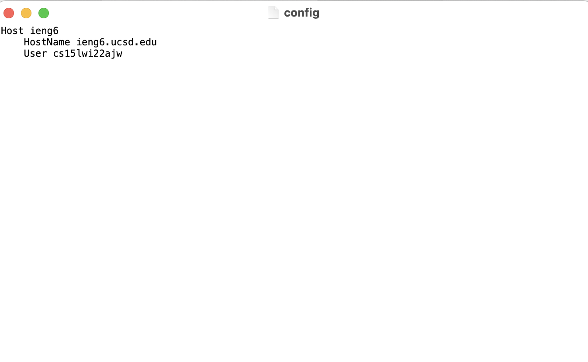
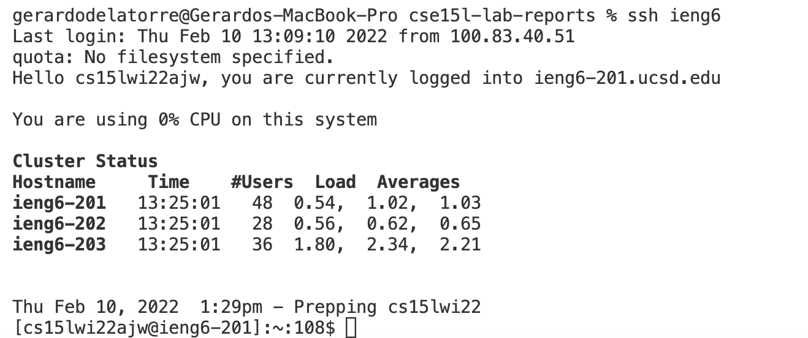
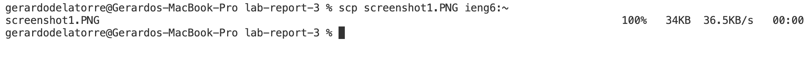

# Lab Report 3 Week 6
## Creating .ssh/config
Let's start by creating the config file, which is likely that some of you all won't have. To do so, head to your terminal and type
```
touch ~/.ssh/config
```
The "touch" command is used to create a file. 

## Editing .ssh/config
After we have created the file, we access the file we just created using the "open"" command:
```
open ~/.ssh/config
```
Right now, .ssh/config should be empty, just like this:


You want to fill .ssh/config following this guideline:
```
Host ieng6
    HostName ieng6.ucsd.edu
    User cs15lwi22zzz (use your username)
```
ieng6 (right after "Host") is the alias you are creating for ssh to interpret as login to the host. You can change the alias to whatever you want, but I will leave it as is

For me, .ssh/config looks like this:


## Logging in to ieng6
As I said before, we can now log in faster to the host by using the host alias we declared on .ssh/config

For me, logging in to ieng6 looks like this:


## Copying a File  to Your Account
Now that we have saved an entry to our desired host, in this case ieng6, we can copy files more easily using the alias we gave the host instead of our entire login info

Instead of doing
```
scp filename.file cs15lwi22zz:~
```

We can now easily do it with
```
scp filename.file ieng6:~
```
On my terminal, it looks like this:
