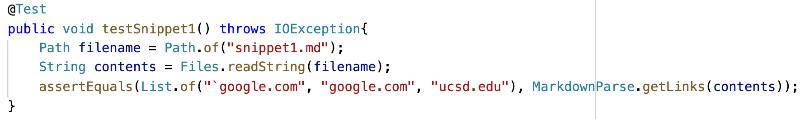
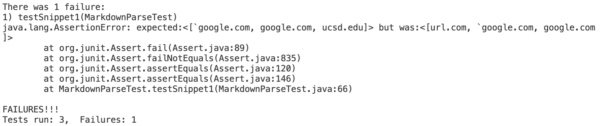
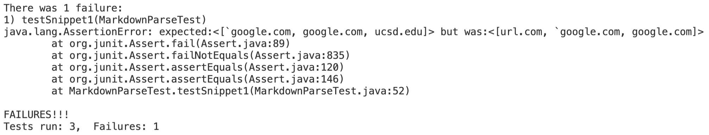

# **Lab Report 4 Week 8**

## Markdown Repositories 
Here is the [link](https://github.com/gdltorre/markdown-parse) to my markdown-parse repository, and 
here is the [link](https://github.com/w2llS/markdown-parse) to the repository I reviewed

## Snippet 1
**What it would produce:**

According to [CommonMark demo site](https://spec.commonmark.org/dingus/), Snippet 1 should produce the following output:

**Turning it into a test:**

We can see from CommonMark that in snippet 1 there is only one valid link, which is "another link" that corresponds to "`google.com". Because of this, I created a test that should check that MarkdownParse ignores the other links and only prints out the link corresponding to "another link".

We can see from CommonMark that in snippet 1 there's only one valid link, which is https://ucsd-cse15l-wi22.github.io/. It's the link that has the title "this title text is really long and takes up more than one line". Because of this, I created a test that should check that MarkdownParse ignores the other links and only prints the one mentioned above

**My implementation output:**

The corresponding output from running the test on my implementation is the following:

Unfortunately, the test did not pass because it was not successful on deciding what was a link and what was not.

**The reviewed implementation output:**

The corresponding output from running the test on the implementation I reviewed is the following:

The implementation I reviewed failed the test too, however it fast more efficient on deciding which links were actual links, as my output printed 3 links and this output only printed 2.

**Do you think there is a small code change that will make your program work for snippet 1?**

I believe that there exists a small code change that could make my program work for snippet 1. For example, I could run an if statement with an indexOf method to check if there are any special characters such as "`", "[", "]", etc. in the link title and then determine if that link should be considered a link. That way, I could filter the two links I did not.

## Snippet 2
**What it would produce:**

According to [CommonMark demo site](https://spec.commonmark.org/dingus/), Snippet 2 should produce the following output:

**Turning it into a test:**

We can see from CommonMark that in snippet 2 there are three valid links, which are "nested link" that corresponds to "a.com", "a nested parenthesized url " that corresponds to "a.com(())", and "some escaped [ brackets ]" that correspondings to "example.com". Because of this, I created a test that tests whether MarkdownParse ignores the link "b.com" and prints the three links I just mentioned

**My implementation output:**

The corresponding output from running the test on my implementation is the following:

Unfortunately, the test did not pass because my MarkdownParse did not have a clear idea of what to do with the special characters "[]" inside of the link title. Also, even though it was close with a.com(()), it still missed the last two )) on the link

**The reviewed implementation output:**

The corresponding output from running the test on the implementation I reviewed is the following:

The implementation I reviewed failed the test too and had the same problem as I did

**Do you think there is a small code change that will make your program work for snippet 1?**

I believe that there exists a small code change that could make my program work for snippet 2. I could create an if statement that checks if we have an extra ")" after the supposedly last ")" and this way we could change the substring to include the real last ")" instead of cutting it short on the first ")" if finds.

## Snippet 3
**What it would produce:**

According to [CommonMark demo site](https://spec.commonmark.org/dingus/), Snippet 3 should produce the following output:

**Turning it into a test:**

We can see from CommonMark that in snippet 3 there's only one valid link, which is "this title text is really long and takes up more than one line" that corresponds to "https://ucsd-cse15l-wi22.github.io/". Because of this, I created a test that should check that MarkdownParse ignores the other links and only prints the one mentioned above

**My implementation output:**

The corresponding output from running the test on my implementation is the following:

Unfortunately, the test did not pass because my MarkdownParse did not have a clear idea of what to do with the special characters "[]" inside of the link title. Also, even though it was close with a.com(()), it still missed the last two )) on the link

**The reviewed implementation output:**

The corresponding output from running the test on the implementation I reviewed is the following:

The implementation I reviewed failed the test too in a similar way to mine.

**Do you think there is a small code change that will make your program work for snippet 1?**

I don't believe that there exists a small code change that could make my program work for snippet 3. There definitely exists a fix to this, but I think it would take longer than 10 lines. The first thing I would do is add an if statement that checks that the given link has ")" at the end, if it doesn't then I wouldn't print that link. After that, I would add an if statement that uses indexOf to check if the link title has break lines between them, if it does then I would skip that link and move to the following one. Lastly, I would add an if statement that checks if the character after "(" at the beginning of the link is a line break and if it is then I would move the index by one and repeat the if statement until we get to a character which should be the beginning of the link.

Because to fix this problem I would add 3 if statements and each if statement has a minimum of 3 lines approximately I doubt that I would be able to keep it under 10 lines, as that would require each if statement to be 3 lines long.