# **Lab Report 5 Week 10**

## How did you find the tests with different results?

The way that I found the tests with different results was through running a script that uses a for loop to print the name of each test in the file and its corresponding result. 
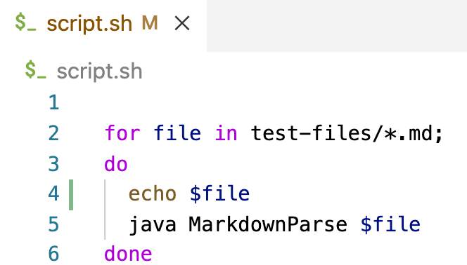

Then, through output redirection I was able to store the results of running the script for my implementation and for the given implementation on different txt files 
```
bash script.sh > results.txt
```
Lastly, I used a combination of diff and output redirection to compare the entirety of both files in which the only difference should be the result of each test and store those differences in its own file.
```
diff results2.txt results.txt > diff.txt
```

Here, results2.txt are the results of my own implementation and results.txt are the results of the provided implementation.

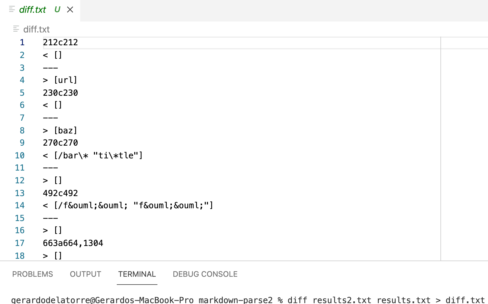

# Test Difference 1
**test-files/194.md**

**Content**:
```
[Foo*bar\]]:my_(url) 'title (with parens)'
[Foo*bar\]]
```

**My output:**
```
[]
```

**Given implementation output:**
```
[url]
```


**CommonMark Expected Output:**
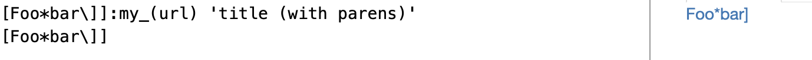

**Which implementation is correct?**

According to CommonMark, the test should contain at least one link, but that link refers to "my_(url)" and not to "url", which is what the given implementation predicted. From my point of view, neither implementation is correct 

I reached this conclusion because even though the given implementation returns a close enough link, it's still isn't the same link that CommonMark returns

On the other hand, my implementation did not even consider the first link as a valid link and thus it's not correct either 


**The problem with the code**

The problem with the given implementation is that the link it returns is whatever is inside of the parentheses and because of this it omits whatever is before it and after them. Because of this "my_" is omitted from the link output. 
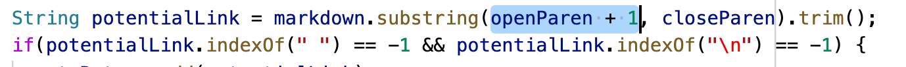


Similarly, the problem with my implementation is that it only considers a link valid if the link title is right after the ]. We can see that it does this by checking if the "(" is after the "]", otherwise it omits the entire link.

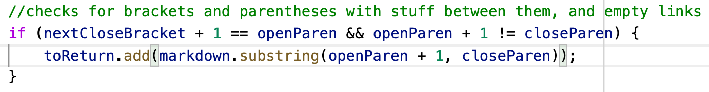

# Test Difference 2
**test-files/22.md**

**Content**:
```
[foo](/bar\* "ti\*tle")
```

**My output:**
```
[/bar\* "ti\*tle"]
```

**Given implementation output:**
```
[]
```

**CommonMark Expected Output:**
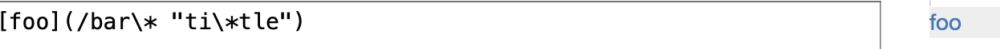

**Which implementation is correct?**

According to [CommonMark](https://spec.commonmark.org/dingus/) this should be considered a link that takes you to "bar\*". Because of this, even though my implementation is successful in determining this link as a "valid link" it takes you to "/bar\\* "ti\\*tle"" instead of "bar\*", thus my implementation is not correct. Furthermore, because the given implementation does not return any link it is also incorrect. Thus, neither implementation is correct in this test. 

**The problem with the code**

The problem with the code of the given implementation is that it has an if statement that checks for links that contain a space in between their link. 
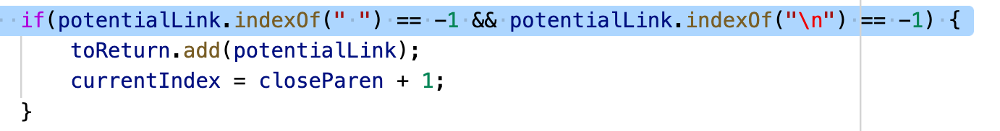

And because the **content of test-files/22.md** is
```
[foo](/bar\* "ti\*tle")
```
The link has a space and gets marked as an invalid link and thus nothing is printed out for this test.

On the other hand, the problem with my implementation is that it does not have any kind of filtering and it only prints whatever is between the parentheses and thus unecessary characters are included in the link.
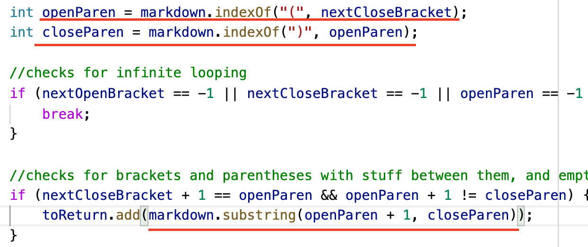

*a possible example of filtering present in the given implementation*
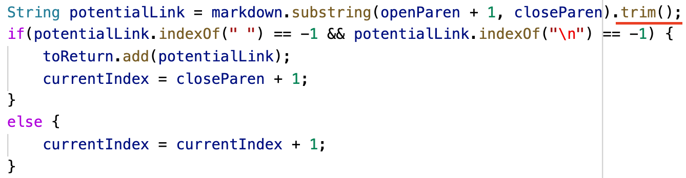

## Test Difference 3

**test-files/495.md**

**Content**:
```
[link](foo(and(bar)))
```

**My output:**
```
[foo(and(bar]
```

**Given implementation output:**
```
[foo(and(bar))]
```

**CommonMark Expected Output:**
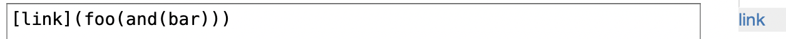

**Which implementation is correct?**

The given implementation is the correct one because according to CommonMark, "[link](foo(and(bar)))" should take us to the link "foo(and(bar))" just like the given implementation predicts. On the other hand, my implementation returns a similar link but it's missing the last parenthesis

**The problem with the code**

The problem with the code is that my implementation stops after finding the first occurence of a close parenthesis and it does not consider the fact that a link may contain extra parentheses. Thus, because this link had two parenthesis at the end it got cut short on the first one.
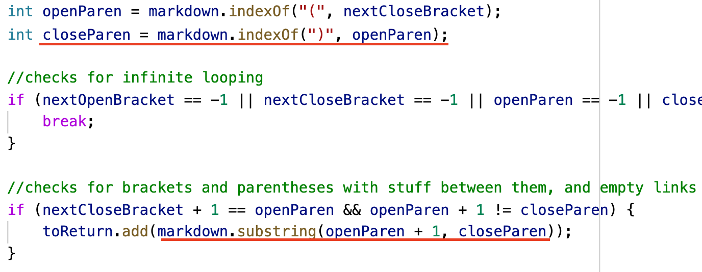


